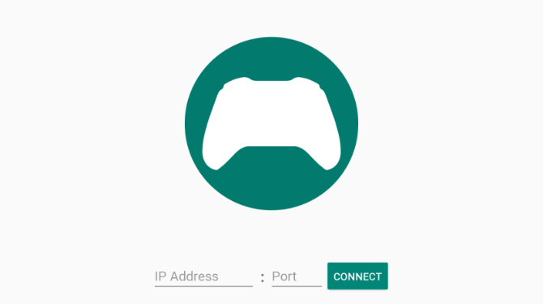
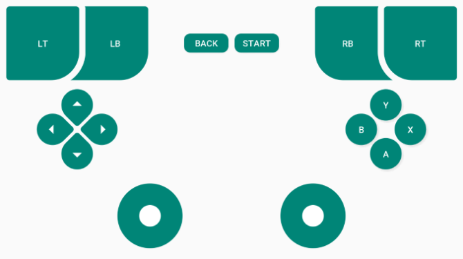

# Controller
Mängupuldi funktsionaalsust pakkuv rakendus Androidile.

## Projektist
Projekti eesmärk on mängupuldi puudmisel see asendada nutiseadmega.  
Projekt on loodud Martin Sõmeri poolt Tallinna Ülikooli bakalaureusetöö raames.

## Kasutatud tehnoloogiad
* [Analoogkangi teek](https://github.com/erz05/JoyStick)
* Android Studio integreeritud programmeerimiskeskkond

## Kasutusjuhend
* Lae rakendus alla [siit](https://github.com/martinsomer/controller/releases)
* Luba seadetes tundmatutest allikatest pärit rakenduste paigaldamine
* Paigalda ning ava rakendus
* Sisesta [serveriprogrammi](https://github.com/martinsomer/controllerserver) IP-aadress ja pordinumber ning vajuta nuppu `Connect`

## Ekraanipildid

## Litsents
[MIT litsents](LICENSE.txt)